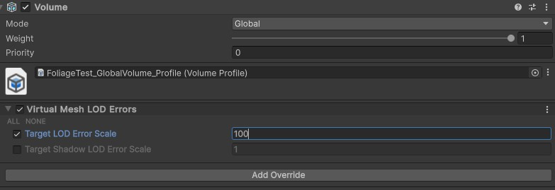
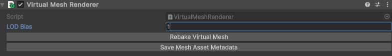

# Configuring Quality <!-- omit from toc -->

Virtual Mesh provides multiple quality parameters, which are expressed as target error values. Error here means relative geometrical error, which occurs during mesh simplification. Coarser LODs have higher error and vice versa. Target error controls what error should we aim when selecting LODs on the GPU.

## Table of Contents <!-- omit from toc -->

- [Global Settings (VirtualMeshConfig)](#global-settings-virtualmeshconfig)
- [Scene Settings (Volume Component)](#scene-settings-volume-component)
- [Renderer Settings (Virtual Mesh Renderer)](#renderer-settings-virtual-mesh-renderer)

## Global Settings (VirtualMeshConfig)

`VirtualMeshConfig` stored at `Assets/Resources/VirtualMesh` allows configuring:
- `Target LOD Error`: global target error.
- `Shadow LOD Error Bias`: extra error added to `Target LOD Error` when selecting shadow LODs.
- `Decay Distance`: distance at which we should select the least detailed LOD levels. This setting allows LODs to get coarser in a non-linear fashion with distance from the camera.

## Scene Settings (Volume Component)

Target LOD errors can be modified per-scene via the Unity Volume system. To do that, create a Global Volume (or use an existing one), click `Add Override` > `Virtual Mesh` > `LOD Errors`. 

## Renderer Settings (Virtual Mesh Renderer)

`Virtual Mesh Renderer` component allows to configure extra per-renderer scale for target LOD errors.

