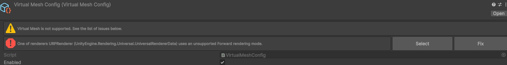
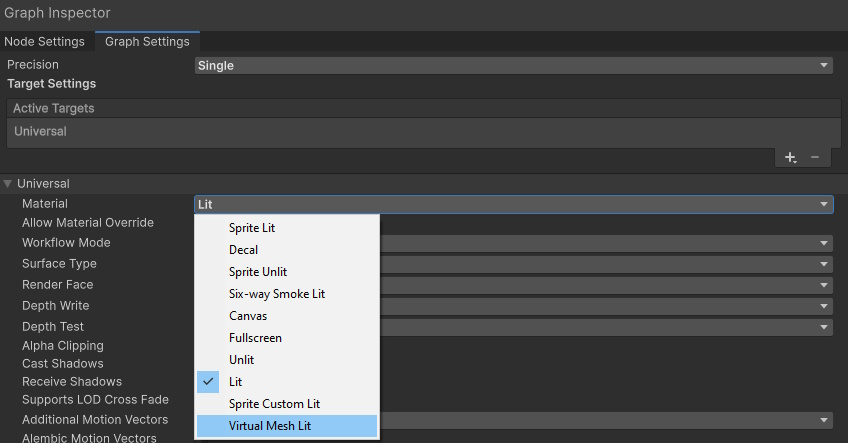
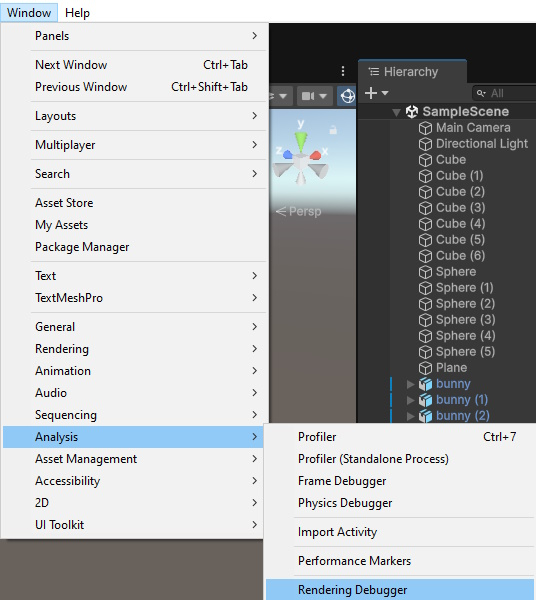
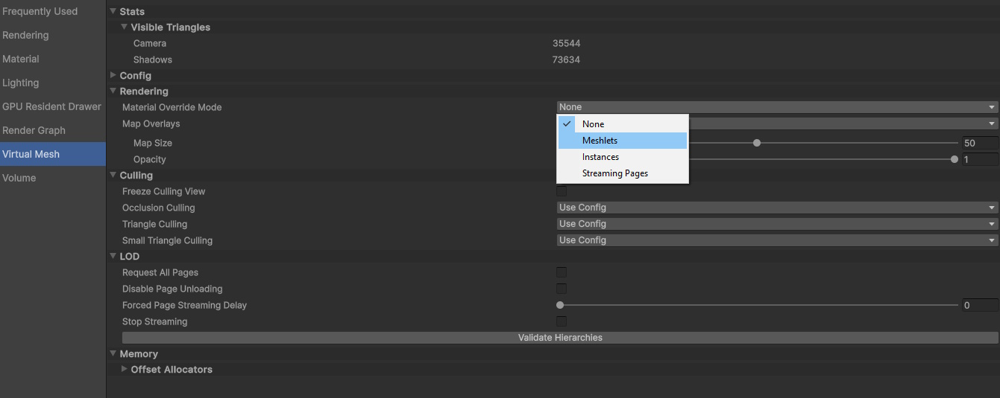
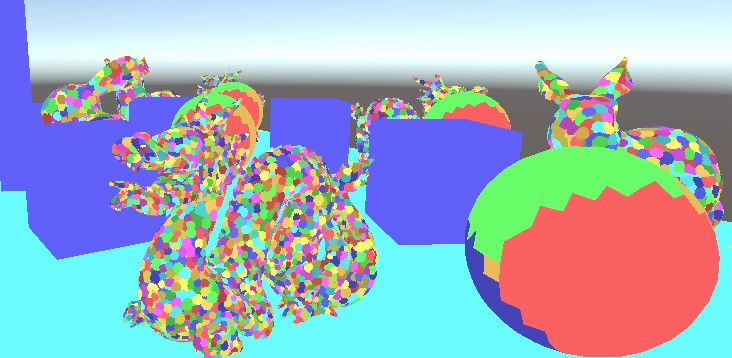
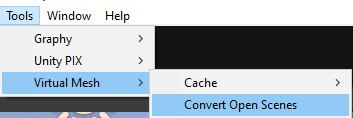

# Project Setup <!-- omit from toc -->

## Table of Contents <!-- omit from toc -->

- [Initialization](#initialization)
- [Converting Shaders](#converting-shaders)
- [Preparing Renderers](#preparing-renderers)
- [Validating](#validating)
- [Automatic Conversion Tool: Convert Open Scenes](#automatic-conversion-tool-convert-open-scenes)

## Initialization

> ⚠️ IMPORTANT: Before installing Virtual Mesh, make sure to create a back-up of the project!

After adding the Virtual Mesh package to the project, find `VirtualMeshConfig`, which will be automatically created at `Assets/Resources/VirtualMesh`. Open it to see whether Virtual Mesh has been successfully initialized. If not, it will display errors with instructions on how to fix them.

## Converting Shaders

Virtual Mesh requires using shaders specifically made for it. Only certain types of URP shaders can be converted to Virtual Mesh:
- `Universal Render Pipeline/Lit` should be substituted with `Universal Render Pipeline/Virtual Mesh/Lit`.
  - Converting `Lit` shaders is as easy as selecting a material and changing its shader to `Universal Render Pipeline/Virtual Mesh/Lit`.
- `Lit Shader Graph` should be changed to `Virtual Mesh Lit Shader Graph`.
  - 

## Preparing Renderers 

> 📝 IMPORTANT: Virtual Mesh supports only `Mesh Renderers`!

For a renderer to use Virtual Mesh, it should have a `Virtual Mesh Renderer` component. Click `Add Component` > `Virtual Mesh` > `Virtual Mesh Renderer`.

## Validating

To see whether the renderers have been successfully setup, go to `Window` > `Analysis` > `Rendering Debugger`:

There, go to the `Virtual Mesh` tab and change `Material Override Mode` to `Meshlets`:

All renderers drawn with Virtual Mesh should be drawn as sets of clusters of different colors:

## Automatic Conversion Tool: Convert Open Scenes

To simplify converting the content, one can use the utility in `Tools` > `Virtual Mesh` > `Convert Open Scenes`.

What it does:
- Finds all renderers with supported shaders (`Universal Render Pipeline/Virtual Mesh/Lit` or `Virtual Mesh Lit Shader Graph`) and adds the `Virtual Mesh Renderer` component to them.
- If a material is editable and its shader can be substituted to a one with Virtual Mesh support (e.g., `Universal Render Pipeline/Lit`), it will be converted automatically.
